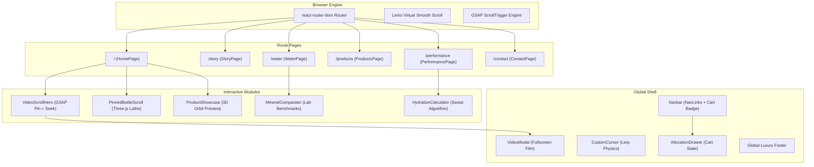

# BOTVOR // Comprehensive Project Documentation & Technical Architecture

> **Project Name:** BOTVOR — Luxury Bottled Drinking Water Brand Web Experience  
> **Brand Monogram:** VM (Vital Elixir)  
> **Tagline:** *"For Every Moment That Moves You"*  
> **Primary Technology Stack:** React 19, TypeScript, Vite, Tailwind CSS, Three.js / React Three Fiber, GSAP ScrollTrigger, Lenis  
> **Repository Location:** `c:\Users\KAVYA\OneDrive\Documents\bottle`  
> **Current Hosting:** `http://localhost:5173/` (Preview Daemon)

---

## 1. Executive Summary & Brand Origin

### 1.1 Conception from Campaign Footage
The project was engineered from the high-definition commercial campaign video (`Untitled ‑ Made with FlexClip-ezremove.mp4`):
* **Name & Monogram:** **BOTVOR** featuring the interlocking **"VM"** monogram and **"VITAL ELIXIR"** botanical crest.
* **Aesthetic Positioning:** High-end sports campaign meets architectural luxury beverage and modern technology showcase (evoking Rimowa, Moncler Grenoble, and Apple product unveils).
* **Cinematic Narrative (5 Moments):**
  1. **The Descent (00:00 – 00:06):** Sculptural glass bottle floating between skyscraper glass canyons at dawn.
  2. **The Drive (00:06 – 00:11):** High-stakes executive in navy suit catching the vessel as water droplets erupt in slow-motion suspension.
  3. **Unbroken Momentum (00:11 – 00:22):** Elite track sprinter drinking mid-stride on an Olympic blue circuit without breaking cadence.
  4. **The Elevation (00:22 – 00:26):** Penthouse rooftop terrace overlooking a glowing sunset skyline.
  5. **Finale Manifesto (00:26 – 00:29):** The architectural vessel standing on black Nero Marquina marble with expanding water ripples.

---

## 2. System Architecture & Component Hierarchy



---

## 3. Directory Structure & File Map

```
c:\Users\KAVYA\OneDrive\Documents\bottle\
├── dist/                          # Production build output
├── public/
│   ├── audio/
│   │   └── ambient_soundscape.mp3 # Ambient atmospheric audio
│   ├── images/                    # Extracted high-res campaign scene stills
│   │   ├── businessman_catch.jpg
│   │   ├── sprinter_drink.jpg
│   │   ├── rooftop_woman.jpg
│   │   └── studio_spotlight.jpg
│   ├── posters/
│   │   ├── hero_poster.jpg        # Video fallback poster
│   │   └── studio_poster.jpg
│   └── videos/
│       ├── hero_optimized.mp4     # Web-ready H.264 +faststart video (7.9 MB)
│       └── hero_scrub.mp4         # All-intra keyframe video (-g 2) for scrubbing
├── src/
│   ├── components/                # Modular reusable UI widgets
│   │   ├── AllocationDrawer.tsx   # Slide-out cart & courier dispatch drawer
│   │   ├── CustomCursor.tsx       # Magnetic dual-ring cursor with trailing physics
│   │   ├── Footer.tsx             # Editorial luxury brand footer
│   │   ├── HydrationCalculator.tsx# Dynamic physiological replenishment matrix
│   │   ├── MineralComparator.tsx  # Interactive mineral breakdown & benchmark table
│   │   ├── Navbar.tsx             # Sticky multi-page header with allocation badge
│   │   ├── Preloader.tsx          # Minimalist brand initialization screen
│   │   ├── ScrollToTop.tsx        # Automatic scroll & Lenis position reset on route change
│   │   ├── VideoModal.tsx         # Modal dialog for 1080p campaign commercial
│   │   └── VideoScrollHero.tsx    # Pin-scrolled video scrubbing & autoplay hero engine
│   ├── data/
│   │   ├── brandContent.ts        # Brand manifesto, narrative chapters, and 3D hotspots
│   │   └── products.ts            # Vessel editions (500ml, 750ml, Carafe, Obsidian)
│   ├── pages/                     # Dedicated multi-page route views
│   │   ├── HomePage.tsx           # Hero scrub, 3D pinned bottle, stories, film section
│   │   ├── StoryPage.tsx          # 2,840m elevation aquifer & 18-year basalt filtration
│   │   ├── WaterPage.tsx          # ISO 17025 lab assay & bioavailable mineral spectrum
│   │   ├── ProductsPage.tsx       # Architectural flint glass collection & 3D preview
│   │   ├── PerformancePage.tsx    # Telemetry case studies & sweat loss calculator
│   │   └── ContactPage.tsx        # Private allocation booking & showroom directory
│   ├── sections/                  # Homepage modular narrative blocks
│   │   ├── AmbitionSection.tsx    # Executive catch & boardroom clarity
│   │   ├── ClimaxSection.tsx      # Marble reflection finale manifesto
│   │   ├── FilmSection.tsx        # Campaign cinema showcase & play trigger
│   │   ├── PerformanceSection.tsx # Athletic endurance & hydration telemetry
│   │   ├── PinnedBottleScroll.tsx # 4-step pinned 3D bottle breakdown (GSAP pin)
│   │   ├── ProductShowcase.tsx    # Interactive 3D bottle preview carousel
│   │   └── StorySection.tsx       # Descent origin story
│   ├── three/                     # WebGL / Three.js 3D rendering pipeline
│   │   ├── BottleCanvas.tsx       # R3F Canvas, environment map, StudioLights, OrbitControls
│   │   ├── BottleModel.tsx        # Double-walled procedural Lathe glass & inner water column
│   │   ├── BottleTexture.ts       # HTML5 Canvas label texture generator ("VM" / "BOTVOR")
│   │   └── StudioLights.tsx       # Key light, rim lights, ground bounce, and gold accent fill
│   ├── types/
│   │   └── index.ts               # Core TypeScript interfaces (Product, SceneMoment, Hotspot)
│   ├── App.tsx                    # Root routing, Lenis configuration, allocation cart state
│   ├── index.css                  # Tailwind styles, glass-panel classes, custom scrollbars
│   └── main.tsx                   # React 19 application entry point
├── package.json                   # Project dependencies and npm scripts
├── tailwind.config.js             # Brand design tokens (dark obsidian, amber, aqua)
├── tsconfig.json                  # Strict TypeScript configuration
└── vite.config.ts                 # Vite bundle configuration
```

---

## 4. Key Technical Innovations

### 4.1 Video Scrubbing & Autoplay Engine (`VideoScrollHero.tsx`)
* **Problem Solved:** Browsers typically treat video either as an un-scrubbable background loop OR freeze on frame 0 during scroll scrubbing.
* **Implementation:**
  1. **Immediate Luminous Playback:** On initial load, the video autoplays (`autoPlay`, `muted`, `loop`, `playsInline`) with lightened text-scrim overlays, displaying the bottle falling in golden sunrise light.
  2. **Seamless Transition to Scroll Scrub:** As the user scrolls past the top threshold (`progress > 0.02`), the engine halts autoplay and binds `video.currentTime` directly to the normalized scroll progress `(p * duration)`.
  3. **GSAP ScrollTrigger Pinning:** `ScrollTrigger.create({ pin: true, pinSpacing: true, end: '+=320%' })` wraps the hero in a dedicated pin-spacer, avoiding CSS `position: sticky` bugs across modern browsers.
  4. **Interactive Timeline & Quick Scene Pills:** Users can click anywhere on the timeline or select pills (`01 ORIGIN`, `02 AMBITION`, `03 VELOCITY`, `04 SERENITY`, `05 FINALE`) to jump to any chapter.

### 4.2 Three.js Procedural 3D Bottle (`BottleModel.tsx`)
* **Mathematical Precision:** Generated using `THREE.LatheGeometry(points, 48)` based on cross-sectional spline profiles:
  * Double-walled crystal flint glass with realistic wall thickness.
  * Ergonomic waist taper and flared shoulder.
  * Machined anodized aluminum cap (`metalness: 0.92`, `roughness: 0.28`).
  * Separate inner water mesh with refractive index `ior: 1.333` and physical transmission `transmission: 0.98`.
  * Procedural micro-bubbles drifting upwards via sinusoidal oscillation in `useFrame`.
  * Dynamically drawn 2D Canvas label texture with interlocking **"VM"** monogram, gold rules, and serif branding.

### 4.3 Smooth Scroll & GSAP Integration (`App.tsx`)
* Lenis virtual smooth-scrolling is connected directly to GSAP ScrollTrigger's tick cycle:
  ```ts
  lenis.on('scroll', ScrollTrigger.update);
  gsap.ticker.add((time) => lenis.raf(time * 1000));
  gsap.ticker.lagSmoothing(0);
  ```
* Container elements utilize `overflow-x-clip` rather than `overflow-x-hidden`, preventing horizontal overflow while preserving viewport pin anchors.

### 4.4 Physiological Sweat Loss Matrix (`HydrationCalculator.tsx`)
* Algorithmic sweat rate model calibrated for athletic endurance:
  $$\text{Fluid Deficit (L)} = \text{Duration (hrs)} \times \left( \frac{\text{Body Mass (kg)}}{75} \times 0.9 \right) \times \text{Intensity Mult} \times \left( 1 + \frac{\text{Temp} - 20}{40} \times 0.5 \right)$$
* Generates tailored BOTVOR vessel replenishment recommendations in real-time.

---

## 5. Design System & Tokens

| Token | Value | Semantic Role |
| :--- | :--- | :--- |
| `brand-dark` | `#080B10` | Deep Midnight Obsidian base background |
| `brand-surface` | `#0E141D` | Elevated container & card surface |
| `brand-elevated` | `#161F2C` | Interactive hover panels & modal dialogs |
| `brand-amber` | `#D4AF37` | Sovereign Olympic Gold / Dawn Stadium accent |
| `brand-aqua` | `#38BDF8` | Glacial Alpine purity & hydrological telemetry |
| `brand-light` | `#F8FAFC` | High-contrast crystalline typography |
| `brand-muted` | `#94A3B8` | Subtitle & technical specification text |

---

## 6. Local Hosting & Operational Commands

### Development Server
```bash
npm run dev
# Starts Vite HMR dev server at http://localhost:5173/
```

### Production Build & Verification
```bash
npm run build
# Compiles TypeScript and builds optimized chunks in dist/

npm run preview -- --host 0.0.0.0 --port 5173
# Serves production build locally and over the local area network
```
